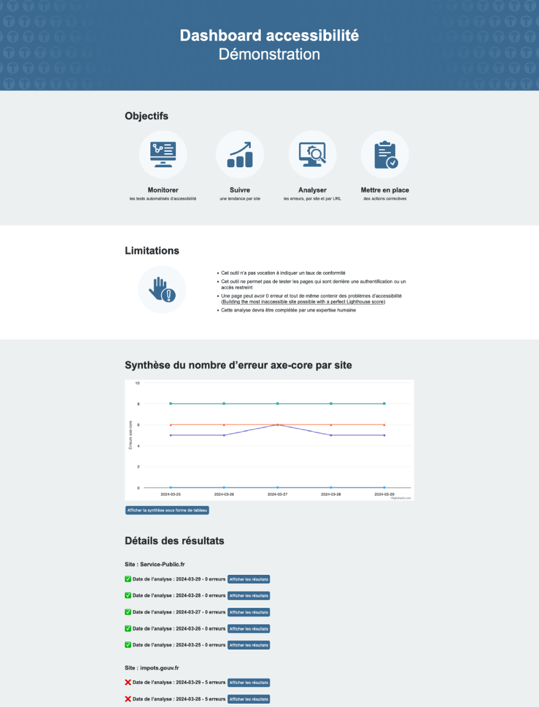

# dashboard-a11y

Demonstration : [https://dashboard-a11y.alwaysdata.net/](https://dashboard-a11y.alwaysdata.net/).

## Objectives
- Monitor, by site, automated accessibility tests ([WCAG 2.2](https://www.w3.org/TR/WCAG22/)) on a sample page using the [axe-core](https://github.com/dequelabs/axe-core) engine
- Monitor trends by site
- Analyze errors, by site and by URL
- Implement corrective actions

## Limitations
- This tool is not designed to indicate a compliance rate.
- This tool does not allow you to test pages that are behind authentication or restricted access.
- A page can have 0 errors and still contain accessibility problems ([Building the most inaccessible site possible with a perfect Lighthouse score](https://www.matuzo.at/blog/building-the-most-inaccessible-site-possible-with-a-perfect-lighthouse-score/)).
- This analysis must be completed by a human expert.

## How it works
1. Fill in the `urls.json` file with the following information: 
    - language (french and english available): `lang`
    - site name: `siteName`
    - URLs: `siteUrls`
2. Install nodes modules: `npm i`
3. To start displaying the dashboard: `npm run build`. The dashboard will be visible at `http://localhost:3000/` 
4. To launch the analysis, go to `http://localhost:3000/test` (make sure the server is launched first, see step 3).

## Static files
The public folder has the following structure:
- css/
    - styles.css
- js/
    - highcharts.js
    - main.js
- img/
    - logo.svg
    - sprite.svg
- i18n/
    - en.json
    - fr.json

## Licence
[Mozilla Public License Version 2.0](https://gitlab.com/temesis/dashboard-a11y/-/raw/main/LICENSE)